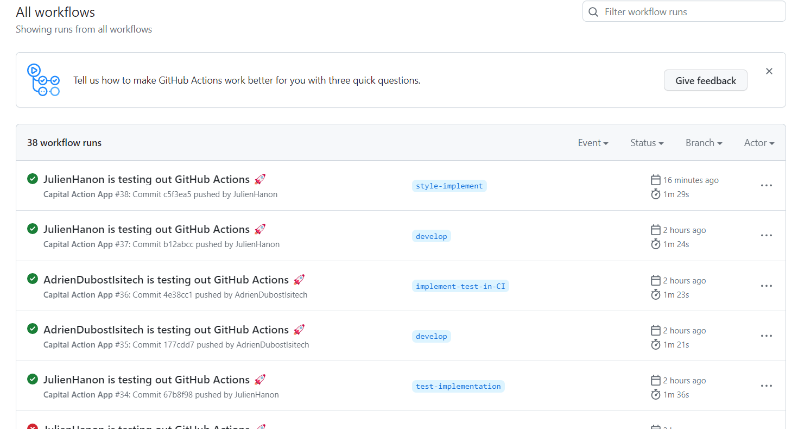
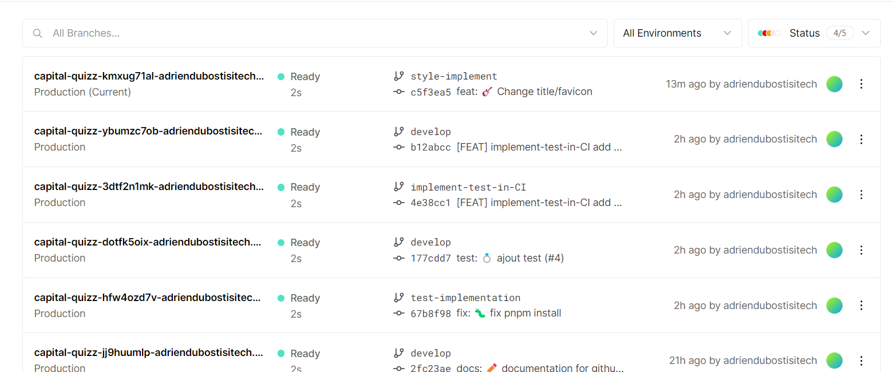

## capitalquiz

# Workflow Git :
    - Les commits seront fait de manière fréquente avec 'git-cz'.
    - Chaque fonctionnalités necéssite la création d'une nouvelle branche 'feature'.
    - Toute branche de fonctionnalités utilisent une branche 'develop' comme branche parente.
    - Toute modification faite dans 'App.tsx' peuvent entrainer des conflits, les commits seront fait sans le prendre en compte
    et les modifications de App.tsx seront faite lors du merge sur 'main'.
    - Chaque merge est soumis à une pull request.
    - Une fois la pull request accepté et le merge réalisé la branche est supprimé.
    - Lorsqu'il y a merge sur master toute les branches liés sont rebase.
    - Une fois que la branche 'develop' aura acquis assez de fonctionnalités une branche 'release' sera créer.
    - La création de la branche 'release' empêche la création de fonctionnalités supplémentaire et sera destiné à la correction de bugs.
    - Une fois terminé la branche 'release' est mergé dans la branche principale 'main' et sera détruite.
    - A chaque push/merge sur master le projet est redeployé.
    - Les versions de release seront tagués pour assurer une agilité de version. 

    *photo workflow projet*

# Découpage du projet : 

    - L'interface de notre application Web possèdera : 
        - Un grand titre centré 
        - Une question qui se met à jour quand le joueur répond à la question
        - Une grid centrée de 2x2 pour afficher 4 réponses possible 
        - un bouton pour valider la réponse
        - une barre de progression

# Deploiement et Intégrations continue avec github actions et vercel
    - On utilise github actions pour automatiser certaines tâches : 
        - On commence par installer Node et pnpm
        - On installe toutes les dépendances necessaires à notre application
        - On build notre application
        - On Effectue une série de test unitaires.
        - On installe le CLI de Vercel
        - On récupère les informations de l'environnement Vercel à l'aide du Token stocké dans les Secrets de Github
        - On build le projet
        - On le deploie ensuite sur le compte vercel. 
        - On log à la fin le status du job. 
        Sur github on a une interface pour suivre toute les étapes automatisés dans github actions : 
        
        On peut aussi visualiser tout les jobs qui ont été effectués : 
        
        A chaque pull request github actions lance son job pour vérifier qu'il n'y ai aucune erreur.
        La preview de la pull request est déployé sur vercel. 

    - Sur Vercel on peut retrouver une interface visuel de nos déploiements. Voir les erreurs de nos builds. On peut aussi accéder aux fichiers qui ont été build. On peut aussi facilement accéder à l'URL du déploiement de notre application :
    https://capital-quizz-fh7fim5e6-adriendubostisitech.vercel.app/
    
# Vercel 
    - Vercel permet de visualiser tout les déploiements effectués : 
    
    - On peut ainsi accèder aux logs des builds sur Vercel pour voir les erreurs ou accéder aux fichiers qui ont été build : 
    
    - Et acceder au lien de notre application déployée : 
    

    Voilà le lien vers notre application (on a corrigé le bug du nombre de questions) :  
    https://capital-quizz-fh7fim5e6-adriendubostisitech.vercel.app/
